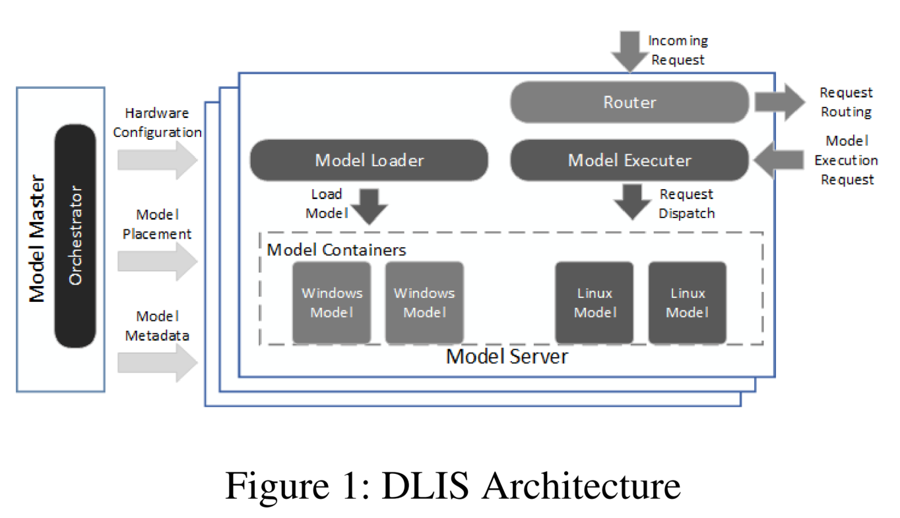
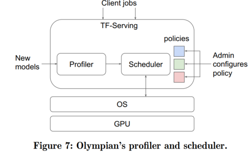
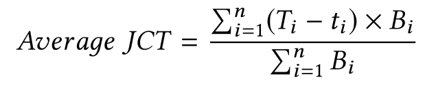

# Inference System

System for machine learning inference.

## Potential ideas
- Horizontal Autoscaling of pods
- 

## Benchmark
- Wanling Gao, Fei Tang, Jianfeng Zhan, et al. "AIBench: A Datacenter AI Benchmark Suite, BenchCouncil". [[Paper]](https://arxiv.org/pdf/2005.03459.pdf) [[Website]](https://www.benchcouncil.org/AIBench/index.html)
- BaiduBench: Benchmarking Deep Learning operations on different hardware. [[Github]](https://github.com/baidu-research/DeepBench#inference-benchmark)
- Reddi, Vijay Janapa, et al. "Mlperf inference benchmark." arXiv preprint arXiv:1911.02549 (2019). [[Paper]](https://arxiv.org/pdf/1911.02549.pdf) [[GitHub]](https://github.com/mlperf/inference)
- Bianco, Simone, et al. "Benchmark analysis of representative deep neural network architectures." IEEE Access 6 (2018): 64270-64277. [[Paper]](https://arxiv.org/abs/1810.00736)
- Almeida, Mario, et al. "EmBench: Quantifying Performance Variations of Deep Neural Networks across Modern Commodity Devices." The 3rd International Workshop on Deep Learning for Mobile Systems and Applications. 2019. [[Paper]](https://arxiv.org/pdf/1905.07346.pdf)

## Autoscaling
- Vertical Autoscaling of GPU Resources for Machine Learning in the Cloud. *Hyeon-Jun Jang*. **IEEE International Conference on Big Data**, 2020 [[paper]](https://ieeexplore.ieee.org/document/9378248) (Citations 0)
  - 指出，云中的资源自动缩放分为水平自动缩放和垂直自动缩放。水平自动缩放可自动缩放虚拟机（VM）的数量，而垂直自动缩放可缩放VM保留的资源量[[paper]](); 
  - 提出了一种垂直自动缩放算法，利用Lyapunov优化在预算限制内提高GPU资源的利用率。我们的算法处理GPU和CPU资源之间的相关性，只需要资源利用率信息来决定扩展GPU资源。
  - 没有开源代码，基于Linux cgroup实现的CPU资源虚拟化和基于 与Timegraph: Gpu scheduling for real-time multi-tasking environments类似思想实现的GPU虚拟化（提供运行时信息，推测与时间片模式相似），亦没有介绍技术细节；
  - 该论文的GPU虚拟化遵循（C，P）表示的周期性资源模型。对于每个时段P，容器可以使用时间C之前的GPU资源。如果容器因GPU的非抢占特性而超限，则将在下一时段为容器分配较少的配额。如果一个容器在一段时间内使用GPU资源的时间少于C，那么它将在下一个时间段内通过向容器分配更大的配额来进行补偿；
  - 上一点，相较于KubeShare的GPU共享方案，推测同是利用时间片模式。不如kubeshare。

## Serving
- DeepCPU: Serving RNN-based Deep Learning Models 10x Faster. *Minjia Zhang*. **ATC**, 2018 [[paper]](https://www.usenix.org/conference/atc18/presentation/zhang-minjia) (Citations 67)

- Deep Learning Inference Service at Microsoft. *Jonathan Soifer*. **OpML**, 2019 [[paper]](https://www.usenix.org/conference/opml19/presentation/soifer) (Citations 10)
  - 描述了深度学习推理服务（Deep learning inference service, DLIS）的特点和作用，为什么需要DLIS;
  - 图1显示了DLIS及其关键组件的概述。Model Master（MM）是一个单例编排器，负责通过考虑模型需求和硬件资源，将模型容器智能地配置到一个或多个服务器上。模型服务器（MS）是服务器单元，可以有数千个。它们有两个角色：路由和模型执行。MS接收来自客户端的传入请求，并将其有效地路由到承载所请求模型实例的另一个MS。从路由服务器接收请求的MS随后以低延迟执行请求。
  - 
  - 描述了DLIS的所需组件，以及各组件(Intelligent model placement, low-latency model execution, efficient routing)的功能.个人工作重点在前两个;
  - Intelligent model placement
    - Model Placement
    - Diverse Hardware Management
  - Low-Latency Model Execution. Different levels of optimization are required to achieve low-latency serving. DLIS supports both system- and model-level optimizations. [[paper]](https://www.usenix.org/conference/atc18/presentation/zhang-minjia). 我们主要关注系统层次的优化。
    - Resource Isolation and Data Locality
    - Server-to-Model Communication

- INFaaS: Automated Model-less Inference Serving. *Francisco Romero*. **ATC**, 2021 [[paper]](https://www.usenix.org/system/files/atc21-romero.pdf) [[github]](https://github.com/stanford-mast/INFaaS) (Citations 2)
  - INFaaS generates model-variants and their performance-cost profiles on different hardware platforms.INFaaS tracks the dynamic status of variants (e.g., over-loaded or interfered) using a state machine, to efficiently select the right variant for each query to meet the applica-tion requirements. Finally, INFaaS combines VM-level (horizontal scaling) and model-level autoscaling to dynamically react to the changing application requirements and request patterns.
  - A model-variant is a version of a model defined by the following aspects: (a) model architecture (e.g., ResNet50, VGG16), (b) programming framework, (e.g., TensorFlow, PyTorch, Caffe2, MXNet), (c) model graph optimizers (e.g., TensorRT, Neuron, TVM, XLA [72]), (d) hyperparameters (e.g., optimizing for batch size of 1, 4, 8, or 16), and (e) hardware platforms (e.g., Haswell or Skylake CPUs, V100 or T4 GPUs, FPGA, and accelerators, such as Inferentia, TPU, Catapult, NPU). 
  - 同样地，将ML lifecycle划分为训练和推理两阶段。并指出推理服务系统面临的挑战：
    - Diverse application requirements. 准确性、时效性要求不同。
    - Heterogeneous execution environments. CPU/GPU/TPU等异构执行环境。
    - Diverse model-variants. 如TVM编译优化。
  - 这种论文，涉及复杂的工程实现(c++), 多种软硬因素（如上，model-variant由多种变量定义）,不适合个人研究者。

## Scheduling

- Olympian: Scheduling GPU Usage in a Deep Neural Network Model Serving System. *Yitao Hu*. **Middleware**. 2018 [[paper]](https://dl.acm.org/doi/10.1145/3274808.3274813) (Citations 7)
  - What is it?
    - we consider the problem of carefully scheduling multiple concurrent DNNs in a serving system on a single GPU to achieve fairness or service differentiation objectives, a capability crucial to cloud-based TF-Serving offerings.
    - Olympian extends TF-Serving to enable fair sharing of a GPU across multiple concurrent large DNNs at low overhead, a capability TF-Serving by itself is not able to achieve
  - mentioned that, DNN models consist of a large number of GPU kernels, and a model serving system like TF-serving queues these kernels in the underlying GPU driver, leaving it to the hardware to schedule kernel execution. Since the driver cannot, in general, differentiate between kernels belonging to different DNNs invoked by different clients, two DNNs with identical computing needs can finish at completely different times. 这个特点，既可以用调度方案缓解，也可以用编译优化（算子融合）方法缓解。Dig more!!!
  - In this paper, we explore techniques to carefully schedule the use of a GPU by multiple concurrent DNNs in a model-serving system like TF-Serving.
  - 
  - 技术点：
    - 扩展TF Serving(C++实现),而非K8S?
    - GPU isolation, but provided by TF-Serving?
  - 介绍了GPU, TF, TF Serving
  - 论文牛逼，未开源代码
  - 启发：
    - 我不具备扩展TF-Serving的能力，而具备扩展K8S的能力；
    - GPU硬件层，还是使用CUDA API劫持的方式实现GPU资源隔离。

- Interference-Aware Scheduling for Inference Serving. *Daniel Mendoza*. **EuroMLSys**. 2021 [[paper]](https://dl.acm.org/doi/10.1145/3437984.3458837) [[yotube]](https://www.youtube.com/watch?v=cB3vnQirNhs)
  - 问题：
    - 调度是考虑模型和硬件的属性，具体是什么呢？
    - 延迟是如何表征的？
    - 模型间的干扰程度如何评定？
  - 使用机器学习模型学习推理模型特征与共同位置延迟劣化之间的映射，但没有介绍技术实现。
  - 未开源代码。

- Irina: Accelerating DNN Inference with Efficient Online Scheduling. *Xiaorui Wu*. **APNET**. 2020 [[paper]](https://dl.acm.org/doi/abs/10.1145/3411029.3411035)
  - Irina, a novel DNN inference scheduler tailored to reducing delay under unpredictable workloads. It explores several strategies that are largely overlooked in existing systems to efficiently share the available (GPU) resources and minimize average inference delay.
  - 
  - 未开源代码，应该也是扩展TF-Serving.

- Co-scheML: Interference-aware Container Co-scheduling Scheme Using Machine Learning Application Profiles for GPU Clusters. *Sejin Kim*. **IEEE International Conference on Cluster Computing (CLUSTER)**, 2020 [[paper]](https://ieeexplore.ieee.org/abstract/document/9229615) (Citations 1)

- A survey on scheduling and load balancing techniques in cloud computing environment. *Subhadra Shaw*. 2014 

- Paragon: QoSAware Scheduling for Heterogeneous Datacenters. *Christina Delimitrou*. 2013

