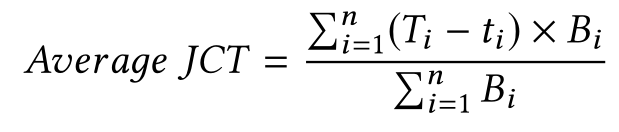

# Scheduling

## Scheduling

- Olympian: Scheduling GPU Usage in a Deep Neural Network Model Serving System. *Yitao Hu*. **Middleware**. 2018 [[paper]](https://dl.acm.org/doi/10.1145/3274808.3274813) (Citations 7)
  - What is it?
    - we consider the problem of carefully scheduling multiple concurrent DNNs in a serving system on a single GPU to achieve fairness or service differentiation objectives, a capability crucial to cloud-based TF-Serving offerings.
    - Olympian extends TF-Serving to enable fair sharing of a GPU across multiple concurrent large DNNs at low overhead, a capability TF-Serving by itself is not able to achieve
  - mentioned that, DNN models consist of a large number of GPU kernels, and a model serving system like TF-serving queues these kernels in the underlying GPU driver, leaving it to the hardware to schedule kernel execution. Since the driver cannot, in general, differentiate between kernels belonging to different DNNs invoked by different clients, two DNNs with identical computing needs can finish at completely different times. 这个特点，既可以用调度方案缓解，也可以用编译优化（算子融合）方法缓解。Dig more!!!
  - In this paper, we explore techniques to carefully schedule the use of a GPU by multiple concurrent DNNs in a model-serving system like TF-Serving.
  - 
  - 技术点：
    - 扩展TF Serving(C++实现),而非K8S?
    - GPU isolation, but provided by TF-Serving?
  - 介绍了GPU, TF, TF Serving
  - 论文牛逼，未开源代码
  - 启发：
    - 我不具备扩展TF-Serving的能力，而具备扩展K8S的能力；
    - GPU硬件层，还是使用CUDA API劫持的方式实现GPU资源隔离。

- Interference-Aware Scheduling for Inference Serving. *Daniel Mendoza*. **EuroMLSys**. 2021 [[paper]](https://dl.acm.org/doi/10.1145/3437984.3458837) [[yotube]](https://www.youtube.com/watch?v=cB3vnQirNhs)
  - 问题：
    - 调度是考虑模型和硬件的属性，具体是什么呢？
    - 延迟是如何表征的？
    - 模型间的干扰程度如何评定？
  - 使用机器学习模型学习推理模型特征与共同位置延迟劣化之间的映射，但没有介绍技术实现。
  - 未开源代码。

- Irina: Accelerating DNN Inference with Efficient Online Scheduling. *Xiaorui Wu*. **APNET**. 2020 [[paper]](https://dl.acm.org/doi/abs/10.1145/3411029.3411035)
  - Irina, a novel DNN inference scheduler tailored to reducing delay under unpredictable workloads. It explores several strategies that are largely overlooked in existing systems to efficiently share the available (GPU) resources and minimize average inference delay.
  - 
  - 未开源代码，应该也是扩展TF-Serving.

- Horus: Interference-Aware and Prediction-Based Scheduling in Deep Learning Systems. *Gingfung Yeung*. **IEEE TRANSACTIONS ON PARALLEL AND DISTRIBUTED SYSTEMS**, 2021 [[paper]](https://ieeexplore.ieee.org/document/9428512) (Citations 1)
  - Horus proactively predicts GPU utilization of heterogeneous DL jobs extrapolated from the DL model’s computation graph features, removing the need for online profiling and isolated reserved GPUs.
  - Background部分简略地综述了：
    - DL system
    - GPU profiling, GPU评测
    - Interference
  - 这是一篇研究GPU利用率与干扰之间的关系地论文，而不是像Kubeshare那种开发出一种调度器的论文。这种探究性的论文值得学习。

- A Cost-Efficient Container Orchestration Strategy in Kubernetes-Based Cloud Computing Infrastructures with Heterogeneous Resources. *Zhiheng Zhong*. **ACM Transactions on Internet Technology**, 2020 [[paper]](https://dl.acm.org/doi/abs/10.1145/3378447) (Citations 16)

- Co-scheML: Interference-aware Container Co-scheduling Scheme Using Machine Learning Application Profiles for GPU Clusters. *Sejin Kim*. **IEEE International Conference on Cluster Computing (CLUSTER)**, 2020 [[paper]](https://ieeexplore.ieee.org/abstract/document/9229615) (Citations 1)

- A survey on scheduling and load balancing techniques in cloud computing environment. *Subhadra Shaw*. 2014

- Paragon: QoSAware Scheduling for Heterogeneous Datacenters. *Christina Delimitrou*. 2013

- Kube-Knots: Resource Harvesting through Dynamic Container Orchestration in GPU-based Datacenters. *Prashanth Thinakaran*. **IEEE International Conference on Cluster Computing**, 2019 [[paper]](https://ieeexplore.ieee.org/document/8891040) [[github](https://github.com/aferikoglou/ECE-Diploma) (Citations 14)
